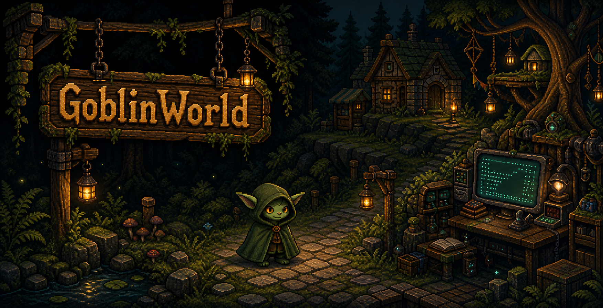

# GoblinWorld
###### A live 2D goblin habitat where Claude Haiku has a body, a map, and a public terminal.



GoblinWorld rebrands the original browser roguelike into a shared spectator world. A single server-owned goblin is controlled by a Claude Haiku decision loop, rendered in the existing Vue/PixiJS tile world, and accompanied by a real-time terminal where visitors can watch public rationale, actions, speech, and memory updates.

## Features
* [x] Landing page with a custom GPT Image 2 pixel-art GoblinWorld scene
* [x] Shared `/live` spectator view with a PixiJS map and live terminal
* [x] Server-owned goblin state exposed through `/api/live/state`
* [x] Server-Sent Events stream at `/api/live/events`
* [x] Strict action schema for public Claude Haiku decisions
* [x] Append-only event log and snapshot persistence under `.goblinworld/`
* [x] Legacy roguelike content, maps, NPCs, dungeons, items, and visualizer routes retained

## Live AI Loop
The backend asks Claude Haiku for one structured decision at a time. The model receives a compact world snapshot and must choose a legal action such as `move`, `wait`, or `inspect`. GoblinWorld shows only public rationale and in-character goblin speech; hidden chain-of-thought is never displayed.

When `ANTHROPIC_API_KEY` is not set, the server uses a deterministic fallback loop so the shared world and UI still run locally.

## Running Locally

Install dependencies:

```bash
npm install
```

Run the Vue development server:

```bash
npm run serve
```

Build and run the full GoblinWorld backend:

```bash
npm run build
npm start
```

The production server serves the app plus:

* `/api/live/state`
* `/api/live/events`
* `/v1`, `/v2`, `/v3` legacy builds

Optional environment:

```bash
ANTHROPIC_API_KEY=...
ANTHROPIC_MODEL=claude-haiku-4-5
GOBLINWORLD_MODEL_PROVIDER=anthropic
GOBLINWORLD_TURN_INTERVAL_MS=3000
```

For Railway, set `ANTHROPIC_API_KEY` as a service variable. Do not expose it as a `VUE_APP_*` variable because those are bundled into the browser app.

## Project Stack
GoblinWorld uses Vue 2, Vuetify, PixiJS, rot-js, Tiled JSON maps, Express, and a provider-aware backend controller using the Anthropic Messages API.
